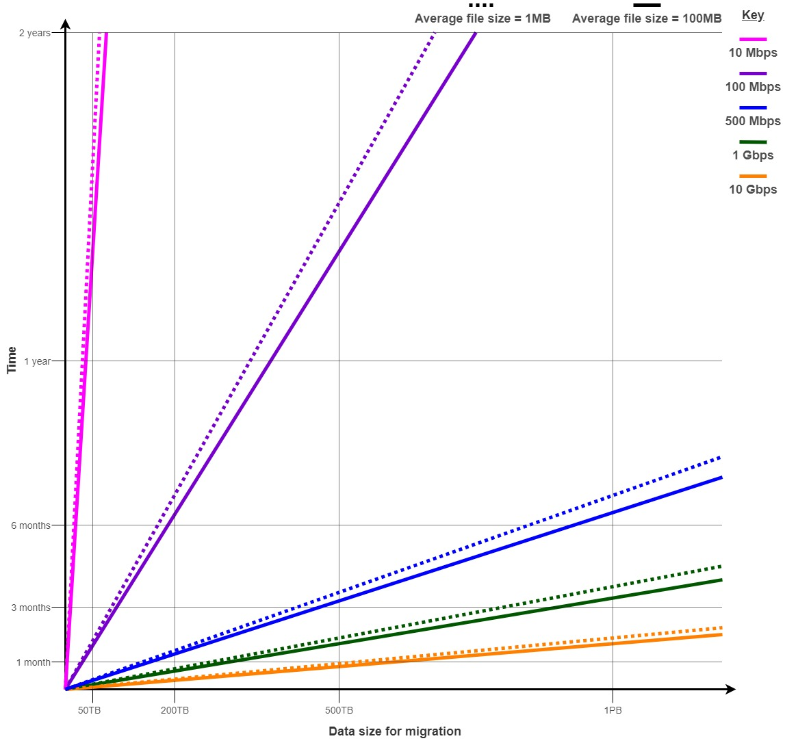

The graph below illustrates network bandwidth capacities and the impact it has on data migration.

_All estimates given are based on a round-trip time (RTT) of 20ms and a packet loss of 1e-05%. See https://wintelguy.com/wanperf.pl  to try your own network throughput calculations._

## File sizes

If your data set contains mainly small files, this will impact the time it will take for the migration. This is due to the increased pressure on disk and network IO when handling many files at once. For an interesting article on how small files impact Apache Hadoop environments, read [Small Files, Big Foils](https://blog.cloudera.com/small-files-big-foils-addressing-the-associated-metadata-and-application-challenges/).

## Round-trip time (RTT)

The RTT between your [source](../../glossary/s.md#source) and [target](../../glossary/t.md#target) environments can prevent you from taking advantage of higher bandwidth levels (if available to you).

For instance, when using a 1Gbps link, the difference between 10ms and 20ms is negligible. When using a 10Gbps link, the difference between 10ms and 20ms can cut your migration time in half.
